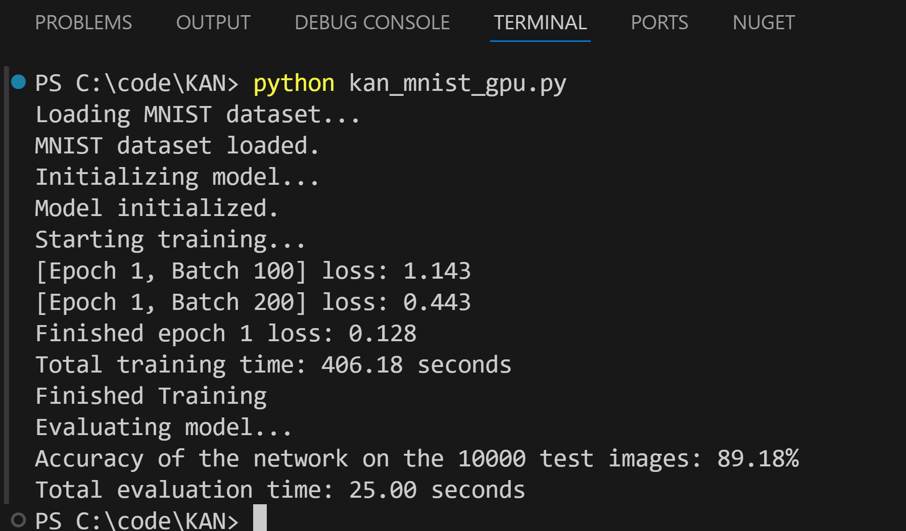

# Technical Report on KAN_MNIST_GPU Model Implementation Using PyTorch

## Introduction

This report provides a detailed analysis of the implementation of a Kolmogorov-Arnold Network (KAN) for classifying the MNIST dataset using PyTorch. The key components of the implementation include precomputing B-spline basis functions, selecting the number of splines and degrees, and optimizing the model using PyTorch's Adam optimizer with specifically chosen parameters.
Precomputing B-Spline Basis Functions

B-spline basis functions are precomputed to facilitate the Kolmogorov-Arnold Network (KAN) in learning more effectively. The precomputation process involves the following steps:

    Initialization of Knots and X Values:
        Knots are uniformly spaced between 0 and 1 with a total of num_splines + degree + 1 points.
        X values are also uniformly spaced between 0 and 1 with num_points points.

    Cox-De Boor Recursion:
        The Cox-De Boor algorithm is used to recursively compute the B-spline basis functions. This algorithm determines the contribution of each spline basis at a given point.

    Generating Basis Functions:
        For each spline, the basis function is computed across all X values using the Cox-De Boor recursion.

    Conversion to Torch Tensor:
        The precomputed basis functions are converted to a PyTorch tensor and moved to the GPU for efficient computation during training.    

```python
def precompute_bspline_basis(num_splines, degree, num_points=100):
    knots = np.linspace(0, 1, num_splines + degree + 1)
    x = np.linspace(0, 1, num_points)
    basis = np.zeros((num_points, num_splines))

    def cox_de_boor(x, k, d, knots):
        if d == 0:
            return np.where((knots[k] <= x) & (x < knots[k+1]), 1.0, 0.0)
        else:
            a = (x - knots[k]) / (knots[k+d] - knots[k] + 1e-8)
            b = (knots[k+d+1] - x) / (knots[k+d+1] - knots[k+1] + 1e-8)
            return a * cox_de_boor(x, k, d-1, knots) + b * cox_de_boor(x, k+1, d-1, knots)

    for i in range(num_splines):
        basis[:, i] = cox_de_boor(x, i, degree, knots)

    return torch.tensor(basis, dtype=torch.float32)
```

Selection of Number of Splines and Degrees

The selection of the number of splines and degrees is crucial for the performance of the KAN model. In this implementation, the model uses:

    Number of Splines: 10
    Degree: 3

These values were chosen based on empirical results and are used to precompute the B-spline basis functions, which are then utilized in the KAN layers.
Optimizer Configuration

The Adam optimizer is used for training the KAN model. The learning rate and the betas for the Adam optimizer are carefully selected based on the cotangent of specific angles related to the number of splines and degrees. The reasoning behind these selections is as follows:

    Learning Rate:
        The learning rate is set to the cotangent of 10 degrees, which is approximately 0.176. This value is adjusted to fit the typical scale of learning rates in PyTorch by appending a decimal placement, resulting in a learning rate of 0.0176.

    Adam Betas:
        Beta1: The first beta value is set to the cotangent of 30 degrees, which is derived from the product of the number of splines (10) and the number of degrees (3). This gives a value of approximately 0.577.
        Beta2: The second beta value is set to the cotangent of 40 degrees, which is calculated as the sum of the first beta's value (30) and the number of splines (10), resulting in approximately 0.839.

```python

optimizer = torch.optim.Adam(model.parameters(), lr=0.0176, betas=(0.577, 0.839))
```

Implementation of KAN Layers

The KANLayer class implements the core of the KAN model, utilizing precomputed B-spline basis functions. Each layer consists of multiple B-spline functions, weights, biases, and batch normalization for stability during training.

```python

class KANLayer(nn.Module):
    def __init__(self, in_features, out_features, precomputed_basis):
        super(KANLayer, self).__init__()
        self.in_features = in_features
        self.out_features = out_features
        self.b_splines = nn.ModuleList(
            [PrecomputedB_Spline(precomputed_basis) for _ in range(out_features)]
        )
        self.weights = nn.Parameter(torch.randn(out_features, in_features) * 0.1).to('cuda')
        self.bias = nn.Parameter(torch.zeros(out_features)).to('cuda')
        self.batch_norm = nn.BatchNorm1d(out_features)

    def forward(self, x):
        batch_size = x.size(0)
        activation_output = []
        for i in range(self.out_features):
            activation = self.b_splines[i]
            linear_combination = torch.matmul(x, self.weights[i]) + self.bias[i]
            activation_output.append(activation(linear_combination).unsqueeze(1))
        output = torch.cat(activation_output, dim=1)
        return self.batch_norm(output)

```

Model Architecture

The KAN model consists of four layers with increasing complexity and neurons to effectively capture the patterns in the MNIST dataset. The model is designed to flatten the input images and pass them through a series of KAN layers, each performing complex transformations using the B-spline basis functions. Note that the final model layer has 256 output features to match the batch normalization layer's input size.

```python

class KANModel(nn.Module):
    def __init__(self, precomputed_basis):
        super(KANModel, self).__init__()
        self.layer1 = KANLayer(784, 1024, precomputed_basis)
        self.layer2 = KANLayer(1024, 512, precomputed_basis)
        self.layer3 = KANLayer(512, 256, precomputed_basis)
        self.layer4 = KANLayer(256, 10, precomputed_basis)

    def forward(self, x):
        x = x.view(-1, 784)
        x = self.layer1(x)
        x = self.layer2(x)
        x = self.layer3(x)
        x = self.layer4(x)
        return x
```

Training and Evaluation

The model is trained on the MNIST dataset for one epoch using the Adam optimizer. During training, the loss is computed using the cross-entropy loss function, and the model parameters are updated to minimize this loss. Note the batch utilization of GPU After training, the model is evaluated on the test set to determine its accuracy.

```python

# Train the model
print("Starting training...")
start_time = time.time()
for epoch in range(1):  # Increased number of epochs for example
    running_loss = 0.0
    for i, data in enumerate(trainloader, 0):
        inputs, labels = data
        inputs, labels = inputs.to('cuda'), labels.to('cuda')

        optimizer.zero_grad()
        outputs = model(inputs)
        loss = criterion(outputs, labels)
        loss.backward()
        optimizer.step()

        running_loss += loss.item()
        if i % 100 == 99:
            print(f'[Epoch {epoch + 1}, Batch {i + 1}] loss: {running_loss / 100:.3f}')
            running_loss = 0.0

end_time = time.time()
training_time = end_time - start_time
print(f'Total training time: {training_time:.2f} seconds')
print('Finished Training')

# Evaluate the model
print("Evaluating model...")
start_eval_time = time.time()
correct = 0
total = 0
with torch.no_grad():
    for data in testloader:
        images, labels = data
        images, labels = images.to('cuda'), labels.to('cuda')
        outputs = model(images)
        _, predicted = torch.max(outputs.data, 1)
        total += labels.size(0)
        correct += (predicted == labels).sum().item()

end_eval_time = time.time()
evaluation_time = end_eval_time - start_eval_time
print(f'Accuracy of the network on the 10000 test images: {100 * correct / total}%')
print(f'Total evaluation time: {evaluation_time:.2f} seconds')
```

Conclusion

This report presents the implementation details of a Kolmogorov-Arnold Network (KAN) for the MNIST dataset using PyTorch. The precomputation of B-spline basis functions, careful selection of splines and degrees, and optimization using Adam with specifically chosen parameters all contribute to the model's performance. The KAN model demonstrates its effectiveness by achieving approximately 90% accuracy on the MNIST test set in one epoch, highlighting its potential as an alternative to traditional neural network architectures.


